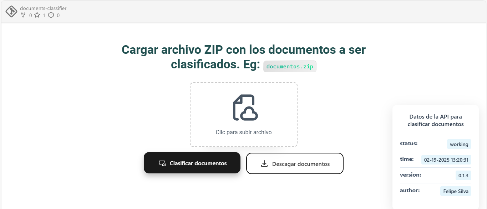

# Document Classifier API



## Índice

1. [Descripción del proyecto](#descripción-del-proyecto)
2. [Requisitos](#requisitos)
3. [Instalación](#instalación)
4. [Uso de la API](#uso-de-la-api)
   - [Clasificar documentos](#clasificar-documentos)
   - [Descargar archivos clasificados](#descargar-archivos-clasificados)
5. [Estructura del proyecto](#estructura-del-proyecto)
6. [Ejemplos de uso](#ejemplos-de-uso)
7. [Contribución](#contribución)
8. [Licencia](#licencia)

---

## Descripción del proyecto

Este proyecto es una API construida con **FastAPI** y **Astro** en una arqutectura de monorepo multipaquete usando **NX** que permite clasificar documentos (PDF e imágenes) en categorías predefinidas utilizando un modelo de machine learning llamado RandomForest. Los documentos se procesan, clasifican y organizan en carpetas según su categoría. Luego, el usuario puede descargar los archivos clasificados en un archivo ZIP.

---

## Requisitos

Para ejecutar este proyecto, necesitas:

- Python 3.13 o superior.
- Las siguientes bibliotecas de Python:
  - `fastapi`
  - `uv` package manager
  - `uvicorn`
  - `pytesseract`
  - `pymupdf` (fitz)
  - `scikit-learn`
  - `numpy`
  - `pydantic`
  - `python-multipart`

Puedes instalar las dependencias usando el archivo `pyproject.toml`:

```bash
uv sync
```

---

## Instalación

```bash
git clone https://github.com/AND3SIL4/documents-classifier.git ./document-classifier
cd document-classifier
npm start
```

## Entorno backend (fastapi)
Crear el entorno virtual

```bash
uv venv # crear entorno virtua
source .venv/bin/activate
```

Ejecuta la aplicación:

```bash
uv run fastapi dev
```

---

## Uso de la API

### Clasificar documentos

Endpoint:
Método: POST
URL: /classify

Descripción: Sube un archivo ZIP que contiene documentos (PDF o imágenes) para clasificarlos.

Solicitud:
Body: form-data

Clave: file

Valor: Archivo ZIP que contiene los documentos.

Respuesta:
Código de estado: 200 OK

Body:

```json
{
  "message": "Classifications completed successfully",
  "request_id": "a15d472c-1458-4fdd-9db5-9edbc8061c0a",
  "download_link": "/download/a15d472c-1458-4fdd-9db5-9edbc8061c0a"
}
```

Ejemplo con curl

```bash
curl -X 'POST' \
  'http://127.0.0.1:8000/classify' \
  -H 'Content-Type: multipart/form-data' \
  -F 'file=@/ruta/al/archivo.zip'
```

### Descargar archivos clasificados

Endpoint:
Método: GET
URL: /download/{request_id}

Descripción: Descarga un archivo ZIP con los documentos clasificados.

Respuesta:
Código de estado: 200 OK

Body: Archivo ZIP (classified_files.zip).

Ejemplo con curl:

```bash
curl -X 'GET' \
  'http://127.0.0.1:8000/download/a15d472c-1458-4fdd-9db5-9edbc8061c0a' \
  --output classified_files.zip
```

---

## Estructura del proyecto

```txt
document-classifier/
│
├── app/
│   ├── main.py                # Código principal de la API
│   ├── machine_learning/
│   │   ├── model.pkl          # Modelo de clasificación
│   │   └── vectorizer.pkl     # Vectorizador de texto
│   └── ...
│
├── pyproject.toml             # Dependencias y configuración del proyecto
├── README.md                  # Documentación del proyecto
└── ...
```

## Licencia

Este proyecto está bajo la licencia MIT. Para más detalles, consulta el archivo LICENSE.

---

_Created by [Felipe Silva](https://github.com/and3sil4)_
